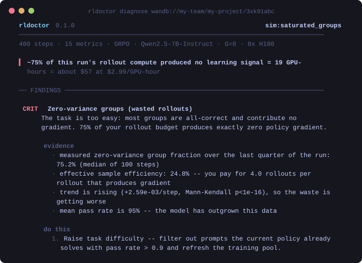

<div align="center">

# rldoctor

**Your GRPO run isn't broken. It's dead, and still logging.**

Point `rldoctor` at a training log and it tells you which failure you have, how much
it has cost you so far, and what to change.

[](https://github.com/junglezke/rldoctor/actions/workflows/ci.yml)
[](https://pypi.org/project/rldoctor/)
[](https://pypi.org/project/rldoctor/)
[](LICENSE)




</div>

---

## The problem

RLVR runs fail silently. The loss curve stays smooth, reward keeps ticking up, and the
job runs to completion — while the thing you actually wanted stopped happening a
thousand steps ago.

Three examples, all of which your dashboard already has the data to detect and none of
which it will tell you about:

- **Your groups are degenerate.** In GRPO, when every rollout in a group earns the same
  reward, the centred advantage is exactly zero for all of them. You paid for `G`
  generations and bought no gradient. TRL logs this as `frac_reward_zero_std` and shows
  it to you as a line on a chart. At 75% it means you are paying for four rollouts per
  useful rollout.
- **Exploration is gone.** Policy entropy decays in every run, so a low value proves
  nothing on its own. What matters is *arrival time*: entropy heading for the floor
  inside your remaining step budget, while reward has already plateaued.
- **Your verifier is being gamed.** An audit of code RL environments found that 28.5% of
  SWE-bench Verified tasks have test suites weak enough to accept a Docker-verified
  *incorrect* patch ([arXiv:2606.16062](https://arxiv.org/abs/2606.16062)). Against a
  grader that permeable, "reward went up" is not evidence of anything.

Every one of these is well documented in the literature and reproduced in a dozen
papers. None of them is packaged as something you can run against your own job.

## Try it in ten seconds

No GPUs, no account, no training run:

```bash
pip install rldoctor
rldoctor demo reward_hacking
```

```
   CRIT  Reward-eval divergence (verifier gaming)
        Training reward is climbing while the held-out score is flat. The policy is
        optimising something your verifier rewards and your task does not.

        evidence
          · normalised training reward has moved +2.63 from its start; held-out
            score has moved +0.13 -- hacking gap +2.25
          · rank correlation between training reward and held-out score: rho=-0.05
            over 17 evaluations
          · the gap is widening (+9.61e-03/step, p=0.000463)

        do this
          1. Read 20 high-reward rollouts end to end. Reward hacks are almost always
             obvious on inspection and almost never visible in aggregate metrics.
          2. Audit the verifier, not the model. For code tasks, check whether your
             tests accept known-wrong patches; for rubric rewards, check for keyword
             stuffing.
          3. Hold out a second verifier that grades the same task differently
             (isomorphic verification). A gap that exists against one grader and not
             another localises the exploit to the grader.
          4. Add an explicit anti-hack penalty for the specific exploit once you
             have identified it, and re-measure the gap rather than assuming it
             closed.
          5. Roll back to the checkpoint before the gap opened -- later checkpoints
             have already been shaped by the exploit.
```

The banner above shows a different run: one where 75% of the rollout budget produced
zero gradient. `advantage_collapse` does not just report that number — it separates
**all-correct** from **all-wrong**. Same symptom, opposite fix, and the bare fraction
cannot tell you which one you have.

Twelve scenarios ship with the tool (`rldoctor demo --list`), each reproducing a
documented failure mode.

## Point it at a real run

```bash
# Nothing to instrument — read a run you already logged
rldoctor diagnose wandb://my-team/my-project/3xk91abc

# Or a TensorBoard directory, a JSONL log, a CSV
rldoctor diagnose ./outputs/grpo-qwen7b/tensorboard
rldoctor diagnose ./logs/train.jsonl --format html -o report.html
```

From Python:

```python
from rldoctor import diagnose, load_run

d = diagnose(load_run("wandb://my-team/my-project/3xk91abc"))
print(d.headline)
# [CRIT] Reward-eval divergence: Training reward is going up while the held-out
# score goes *down*. This is the textbook signature of reward hacking. (+2 more)

for f in d.problems:
    print(f.severity.label, f.title, "->", f.prescription[0])
```

### Catch it during the run, not in the post-mortem

A post-hoc report tells you that you wasted 40 GPU-hours. A live monitor stops you.

```python
from rldoctor.live import LiveMonitor

monitor = LiveMonitor(config=cfg, check_every=25)
for step, metrics in training_loop():
    monitor.log(metrics, step=step)     # logs a warning the first time something breaks
```

On TRL, that is one line:

```python
from rldoctor.integrations.trl import RLDoctorCallback

trainer = GRPOTrainer(..., callbacks=[RLDoctorCallback(report_path="report.html")])
```

On the bundled `entropy_collapse` scenario, the live monitor flags the run at **step
124 of 400** — with a projected step at which exploration runs out, and the DAPO
clip-higher fix, before three quarters of the budget is spent.

### In CI

```bash
rldoctor diagnose ./logs/train.jsonl --fail-on critical --format markdown -o $GITHUB_STEP_SUMMARY
```

## What it checks

| Detector | Catches | Needs |
|---|---|---|
| `advantage_collapse` | Zero-variance GRPO groups; separates *too easy* from *too hard* | `frac_reward_zero_std`, or estimates it from a bounded reward |
| `entropy_collapse` | Exploration exhausted, with a projected arrival time at the floor | `entropy` |
| `reward_hacking` | Training reward and held-out score pulling apart | `reward` + an eval series |
| `length_pathology` | Paid-by-the-token length growth; truncation poisoning the advantage | `completions/mean_length` |
| `clip_saturation` | Update thrown away by the trust region; asymmetric clipping starving exploration | `clip_ratio/*` or `actor/pg_clipfrac` |
| `kl_drift` | Runaway drift, or a policy strangled by its own KL penalty | `kl` |
| `gradient_pathology` | NaNs, vanishing updates, recurring spikes | `grad_norm` |
| `reward_composition` | An auxiliary term owning the reward variance; dead components | per-function reward series |
| `plateau` | The run stopped learning N steps ago and is still burning budget | `eval_score` or `reward` |

Every finding carries **evidence** (the numbers it fired on), a **prescription** (what to
change, with the config key), and **references** (the paper the threshold comes from).
A finding without a suggested change is a complaint, not a diagnosis, and the test suite
enforces that every warning has one.

Run `rldoctor detectors` for the full list, `rldoctor fields` for the metric aliases.

## It reads the log you already have

Detectors are written against a canonical schema; framework keys are resolved onto it in
three passes — exact alias, suffix match, then normalised token match. `actor/entropy`,
`entropy`, `policy/entropy` and `some_new_worker/entropy` all resolve to the same field,
so a framework renaming a key in a point release degrades gracefully instead of silently
producing a worse report. Anything unresolved is reported rather than dropped:

```
  3 log keys were not recognised: actor/my_custom_metric, ...
  If one of those is a metric rldoctor should understand, please open an issue.
```

Known-good with **verl**, **TRL**, and any loop that hands us a list of dicts. One
required dependency: `numpy`.

## How it decides

Training curves are noisy, heavy-tailed, and routinely contain a handful of catastrophic
steps. Ordinary least squares and plain means over-react to those, which is precisely how
a diagnostic earns a reputation for crying wolf. So:

- **Theil–Sen** slopes and **Mann–Kendall** significance instead of OLS. A ~29% breakdown
  point means four exploded steps cannot flip a verdict. (There is a test that asserts
  OLS *is* wrecked on the same input.)
- **Detrended CUSUM** for level shifts, with the noise scale estimated from successive
  differences. A CUSUM on a rising series otherwise "finds" a shift at the midpoint every
  time, because a ramp really does have different means either side of any split.
- **Model-selecting extrapolation.** Entropy decays multiplicatively, so a straight-line
  projection reads today's steep slope as if it continued forever. On the bundled
  collapse scenario, asked at step 100 when entropy will hit the floor, a linear-only
  projection answers step 130 and the log-linear fit answers step 156; the true crossing
  is step 161. Linear reports half the time you actually have. `project_threshold` fits
  both, keeps whichever has the smaller residual in the original units, and tells you
  which one it used.
- **Conditional firing.** Entropy decay with reward still climbing is convergence.
  Entropy decay with reward flat is collapse. Length growth with held-out score growing
  proportionally is a reasoning model doing its job; length growth without it is padding.
  The detectors check the second signal before they accuse you of the first.

Thresholds and their rationale are documented in [`docs/detectors.md`](docs/detectors.md).
Disagree with one? They are module-level constants with comments explaining the choice.

## What it will not do

Being explicit about this, because a diagnostic tool that oversells itself is worse than
none:

- **It cannot see your rollouts.** It reads scalar metrics. It can tell you the shape of
  reward hacking is present; it cannot show you the exploit. Every reward-hacking
  prescription starts with "read 20 high-reward rollouts", because that is genuinely the
  step that finds it.
- **Cost figures are estimates.** Derived from logged step time, on-demand list GPU
  prices, and an assumption that ~70% of step wall-clock is rollout generation. Override
  with `--gpu-hour-cost`. Treat them as an order of magnitude, which is all they need to
  be to change a decision.
- **Some checks need history.** `reward_composition` reports information rather than a
  verdict below ~150 logged points, because variance shares during warm-up reflect
  whichever term is still ramping. It says so rather than guessing.
- **It is not a monitoring service.** No daemon, no account, no telemetry, no network
  calls. It reads a log and prints a report.

## Design principles

1. **A false positive costs more than a false negative.** A tool that cries wolf gets
   uninstalled after one bad alert, and then catches nothing. The healthy-run scenario is
   asserted across five seeds to produce zero warnings.
2. **Never guess from missing data.** If a check's inputs are absent it returns `SKIPPED`
   and names the key that would have enabled it.
3. **Show the arithmetic.** Every finding carries the numbers it fired on, so you can
   disagree with a threshold rather than with the tool.
4. **Never break the training loop.** `LiveMonitor` swallows its own exceptions and
   disables itself with one warning. A monitoring bug must not kill a job that is fine.
5. **Stay installable.** `numpy` only. Anything that drags a UI stack or a training
   framework into a cluster image will not get installed on the cluster where it is
   needed.

## Development

```bash
git clone https://github.com/junglezke/rldoctor && cd rldoctor
pip install -e ".[dev]"
pytest                # 117 tests
rldoctor selftest     # detection matrix across all 12 scenarios
ruff check src tests
python tools/make_banner.py   # regenerate the README image
```

`rldoctor selftest` is the honest summary of what the tool can and cannot catch — it runs
every detector against every simulated pathology and prints the matrix, including the
false-positive check on the healthy run.

## Contributing

The most valuable contribution is **a metric key we do not recognise**. If
`rldoctor diagnose --verbose` lists something from your framework, open an issue with the
key name and what it measures — that is a one-line fix that makes the tool work for
everyone on that stack.

After that: a failure mode you have hit that we do not detect. Adding a detector means
one file in `src/rldoctor/detectors/` and one scenario in `simulate.py`. See
[CONTRIBUTING.md](CONTRIBUTING.md).

## Citing

If `rldoctor` is useful in your work, please cite it — see [CITATION.cff](CITATION.cff).

## License

Apache-2.0.
